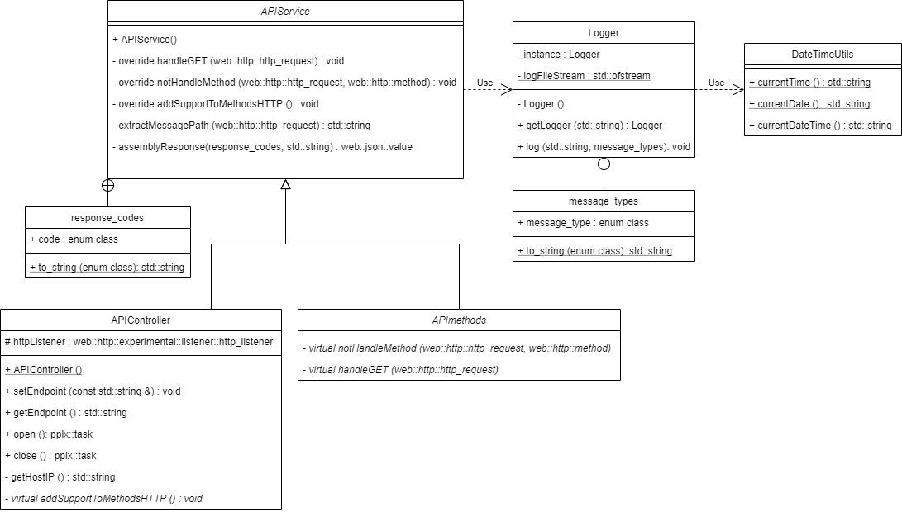
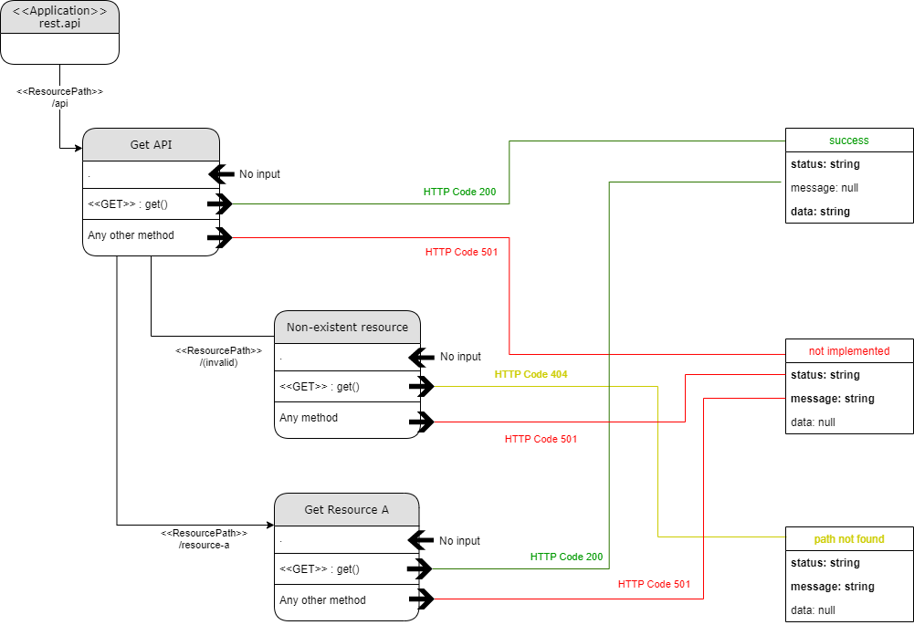

# API REST C++

## Description

Simple REST API developed in C++ to return json responses. The API contains the structure to response to any HTTP method, but the only one really handling something in this demo is the method GET. Other methods are responding as "not implemented"


## Repo files overview

* Folder dependencies:
  * Shell script that can be used to install the supporting libraries for API (it considers debian-based distros, with APT pre-installed)
* Folder documents:
  * UML and other diagrams documenting the development
    <details><summary>UML class diagram</summary></details>
    <details><summary>REST logic diagram</summary></details>    
* Folder src:
  * Class [APIMethods](src/APIMethods.h):
    * Abstract class that defines the handler methods to be implemented for each HTTP Method
  * Class [APIController](src/APIController.h):
    * Implements the very basic functions around the listener portion of the API (open/close and endpoint configuration)
	* It also defines the virtual method that shall be implemented by service to connect HTTP Methods handlers (the ones from APIMethods) to the listener
  * Class [APIService](src/APIService.h):
    * Implements handler methods inherited from APIMethods (all the logic of the service: route paths, deals with requests, assemble responses etc)
	* Connects handler methods implemented into the listener of APIController
  * Class [include/Logger](src/include/Logger.h):
    * Singleton class for basic logging
  * Class [include/DateTimeUtils](src/include/DateTimeUtils.h):
    * Simple date/time methods to support logging
* File [main.cpp](main.cpp):
  * Instantiates APIService, configuring the endpoint to be used (port can be changed passing value by parameter)
* File [makefile](makefile):
  * Compiles and links all files and libraries into a 'bin/rest.app' binary


## How to build

### Dependencies

The supporting libraries can be installed using shell script included in 'dependencies' folder. Compiler's linking flags for libraries are already defined into makefile. Dependencies are:

* **C++ Rest SDK**: Microsoft project for cloud-based client-server communication in native code using a modern asynchronous C++ API design
  * [GitHub page](https://github.com/microsoft/cpprestsdk)
  * [Main page](https://microsoft.github.io/cpprestsdk/index.html)
  * Linking flags for g++: -lcpprest
  * Requirement: **Dynamic Loaded (DL) Libraries**, to use libraries loaded during runtime
    * [Main page](https://tldp.org/HOWTO/Program-Library-HOWTO/dl-libraries.html)
    * Linking flags for g++: -ldl
  * Requirement: **Pthread** library, to support pplx tasks
    * Linking flags for g++: -lpthread
* **Boost C++ Libraries**: portable C++ widely used source libraries
  * [Main page](https://www.boost.org/)
  * Linking flags for g++:
    * -lboost_system (supporting API classes and DateTimeUtils)
    * -lboost_filesystem (supporting Logger)
  * Requirement: **Crypto++ Library**
    * [Main page](https://www.cryptopp.com/)
    * Linking flags for g++: -lcrypto

Installing dependencies:
```
$ cd <app-root-folder>
$ chmod +x dependencies/install_dependencies.sh
$ ./dependencies/install_dependencies.sh
```

### Make

A makefile is included to compile and link all classes included:
* Compiling flags for dependencies are parameterized by CFLAGS (optimized for fastest level of execution, degrading compiling time)
* Linking flags for dependencies are parameterized by LFLAGS
* Compiles all .\*cpp files in DIR_SRC, plus main.cpp located in the same folder that makefile, generating respective .\*o files into DIR_BUILD
* Links all .\*o files from DIR_BUILD into a binary whose name is defined by TARGET_EXEC and location by DIR_BIN

Installing requirements for build with makefile:
```
$ install apt g++ make -y
```

Executing makefile:
```
$ cd <app-makefile-folder>
$ make
```

## How to run

### Binary

To run it in default port 8080:
```
$ ./bin/rest.app
```

To run it in any other port:
```
$ ./bin/rest.app <port>
```

### API calls

Considering that binary is running in a host with IP 44.192.56.28, at port 8080. Follow some examples of request using ```curl```:

_Example 1_
```
curl -v --request PUT http://44.192.56.28:8080/api
```

```json
*   Trying 44.192.56.28:8080...
* TCP_NODELAY set
* Connected to 44.192.56.28 (44.192.56.28) port 8080 (#0)
> PUT /api HTTP/1.1
> Host: 44.192.56.28:8080
> User-Agent: curl/7.68.0
> Accept: */*
>
* Mark bundle as not supporting multiuse
< HTTP/1.1 501 Not Implemented
< Content-Length: 62
< Content-Type: application/json
<
* Connection #0 to host 44.192.56.28 left intact
{"data":null,"message":"PUT not implemented","status":"error"}
```

_Example 2 (curl with no request specified uses GET by default)_
```
curl -v --request GET http://44.192.56.28:8080/api
curl -v http://44.192.56.28:8080/api
```

```json
*   Trying 44.192.56.28:8080...
* TCP_NODELAY set
* Connected to 44.192.56.28 (44.192.56.28) port 8080 (#0)
> GET /api HTTP/1.1
> Host: 44.192.56.28:8080
> User-Agent: curl/7.68.0
> Accept: */*
>
* Mark bundle as not supporting multiuse
< HTTP/1.1 200 OK
< Content-Length: 73
< Content-Type: application/json
<
* Connection #0 to host 44.192.56.28 left intact
{"data":"API REST for <demonstration>","message":null,"status":"success"}
```

_Example 3_
```
curl -v http://44.192.56.28:8080/api/resource-a
```

```json
*   Trying 44.192.56.28:8080...
* TCP_NODELAY set
* Connected to 44.192.56.28 (44.192.56.28) port 8080 (#0)
> GET /api/resource-a HTTP/1.1
> Host: 44.192.56.28:8080
> User-Agent: curl/7.68.0
> Accept: */*
>
* Mark bundle as not supporting multiuse
< HTTP/1.1 200 OK
< Content-Length: 90
< Content-Type: application/json
<
* Connection #0 to host 44.192.56.28 left intact
{"data":"Yeah! Nicely done handling GET for resourceA!","message":null,"status":"success"}
```

_Example 4_
```
curl -v --GET http://44.192.56.28:8080/api/resource-b
```
```json
*   Trying 44.192.56.28:8080...
* TCP_NODELAY set
* Connected to 44.192.56.28 (44.192.56.28) port 8080 (#0)
> GET /api/resource-b HTTP/1.1
> Host: 44.192.56.28:8080
> User-Agent: curl/7.68.0
> Accept: */*
>
* Mark bundle as not supporting multiuse
< HTTP/1.1 404 Not Found
< Content-Length: 57
< Content-Type: application/json
<
* Connection #0 to host 44.192.56.28 left intact
{"data":null,"message":"path not found","status":"error"}
```

_Example 5_
```
curl -v --GET http://44.192.56.28:8080/api/resource-a/subresource
```
```json
*   Trying 44.192.56.28:8080...
* TCP_NODELAY set
* Connected to 44.192.56.28 (44.192.56.28) port 8080 (#0)
> GET /api/resource-a/subresource HTTP/1.1
> Host: 44.192.56.28:8080
> User-Agent: curl/7.68.0
> Accept: */*
>
* Mark bundle as not supporting multiuse
< HTTP/1.1 200 OK
< Content-Length: 92
< Content-Type: application/json
<
* Connection #0 to host 44.192.56.28 left intact
{"data":"Yeah! Nicely done handling GET for subresource!","message":null,"status":"success"}
```

### Accessing logs

The class Logger in use **always** generate logs inside a subfolder \/log into the same folder where binary is located. The main.cpp is not defining any log name when using Logger class, and for that, the log file will be named with the date from the day that binary started to run (year-month-day.log).

If deployed with same structure of this repo: ```bin\log\2021.Apr.14.log```
